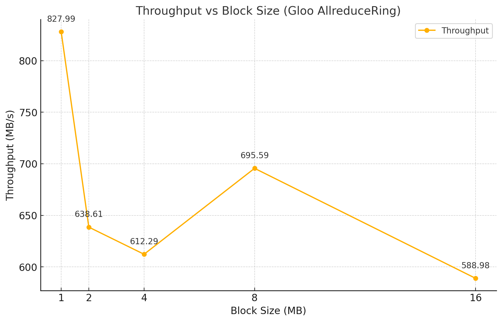

# Test tcp pair benchmark

Test gloo tcp pair benchmark on server, start two ranks in localhost, use tcp pair to communicate.

## How to run

```bash
mkdir build
cmake ../ -DCMAKE_CXX_FLAGS="-static-libstdc++" -DCMAKE_CXX_STANDARD=14 -DBUILD_TCP_BENCHMARK=1  -DOPENSSL_ROOT_DIR=/home/lvbo/project/gloo_bench/gloo/gloo_test_lib/ssl_install -DOPENSSL_LIBRARIES=/home/lvbo/project/gloo_bench/gloo/gloo_test_lib/ssl_install/lib/libssl.so.1.1
```

rank0 process:
```bash
PREFIX=test SIZE=2 RANK=0 BLOCK_SIZE=1 ./gloo/tcpbench/tcp_benchmark
```

rank1 process:
```bash
PREFIX=test SIZE=2 RANK=1 BLOCK_SIZE=1 ./gloo/tcpbench/tcp_benchmark
```

test different block size, change BLOCK_SIZE in above command.
```bash
PREFIX=test SIZE=2 RANK=0 BLOCK_SIZE=1 ./gloo/tcpbench/tcp_benchmark
PREFIX=test SIZE=2 RANK=0 BLOCK_SIZE=2 ./gloo/tcpbench/tcp_benchmark
PREFIX=test SIZE=2 RANK=0 BLOCK_SIZE=4 ./gloo/tcpbench/tcp_benchmark
PREFIX=test SIZE=2 RANK=0 BLOCK_SIZE=8 ./gloo/tcpbench/tcp_benchmark
PREFIX=test SIZE=2 RANK=0 BLOCK_SIZE=16 ./gloo/tcpbench/tcp_benchmark
```

### Test result

